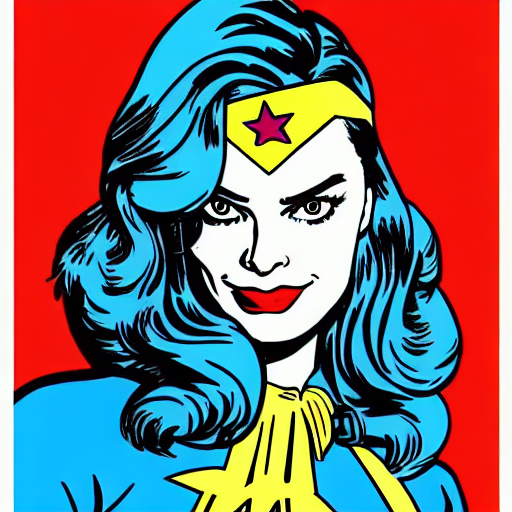
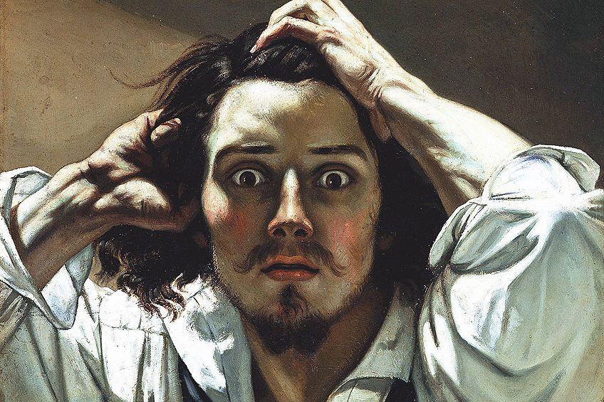
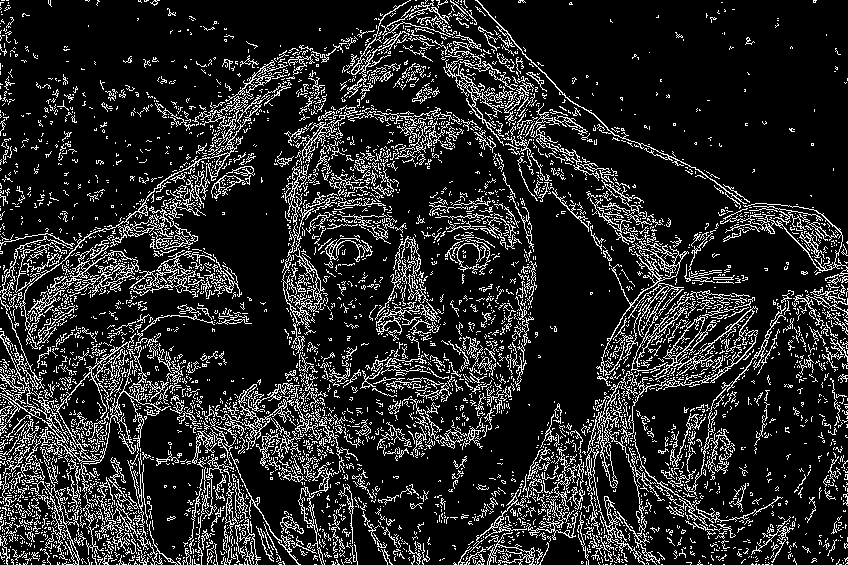
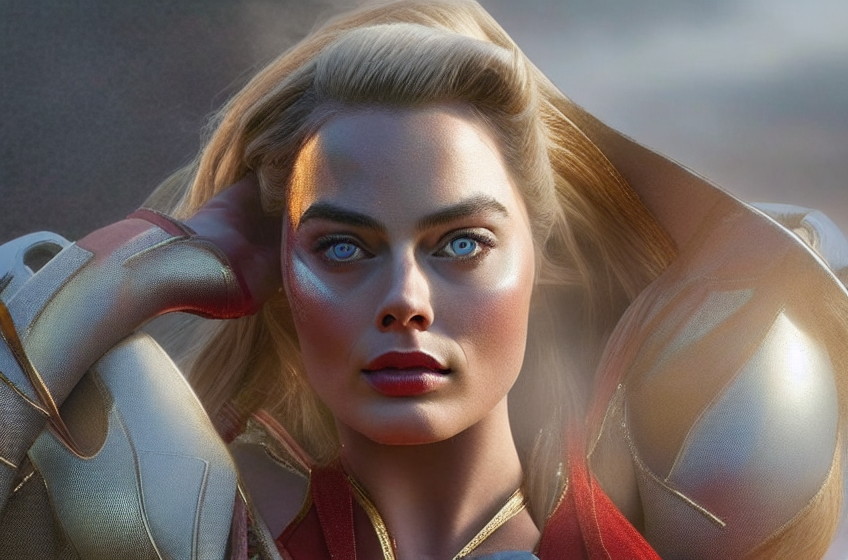
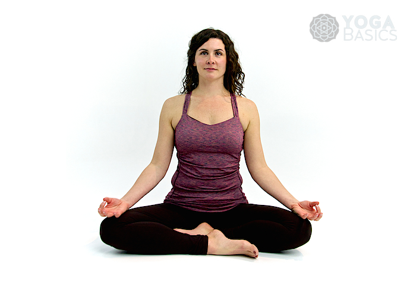
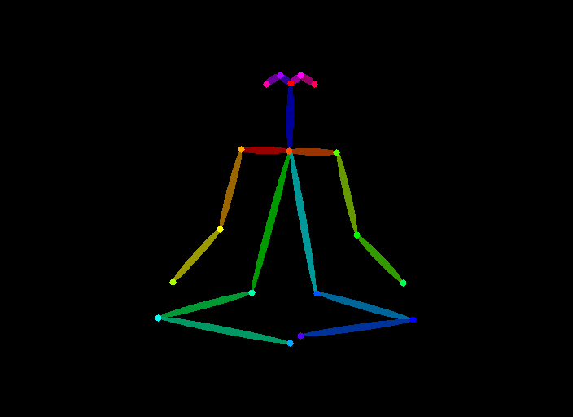
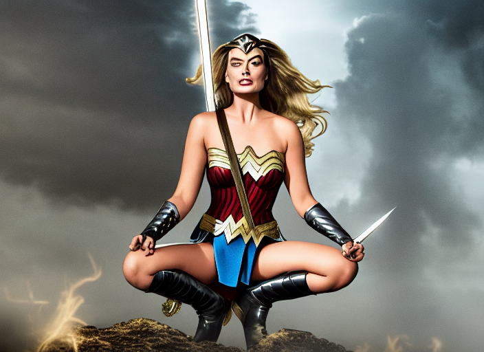
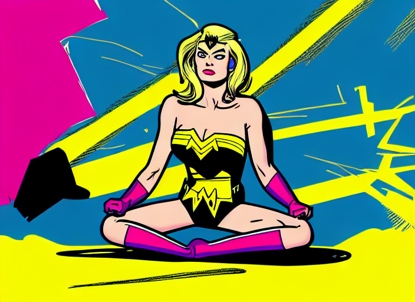

# Stable Diffusion with Self-Guided Attention and ControlNet

## 1. Overview

This is Stable Diffusion built on pre-trained Stable Diffusion v1.5 weights with Self-Attention Guidelines (SAG) to enhance generated image's stability. It also uses ControlNet, a neural network model, to support additional input to control the image generation. Additionally, the model can add artistic features to the generated image by utilizing trained style weights.

This model is built on Hugging Face modules. It utilizes Tokenizer, Text Encoder, Variational Auto Encoder and Unet model from it.

1. Tokenizer - creates tokens with padding to match required length.
2. Text Encoder - Get token embedding from tokens and the positional embedding. It is then combined and fed to a transformer model to get the output embedding
3. UNet - Takes in noisy latents and predicts the noise residual of the latent shape.
4. Variational Autoencoder - Takes in the latents and decodes it into the image space.

## 2. Features

### 2.1. Self Attention Guidelines

Self attention guidelines helps stable diffusion to improve generated image. It uses the intermediate self-attention maps to adversially blur and guides the model. Parameter `sag_scale` controls the SAG influence on the model.

### 2.2. ControlNet support

ControlNet conditions the diffusion model to learn specific user input conditions (like edges, depth). This helps it generate images which are related to the desired spatial context. `canny` and `openpose` controlnets are supported in this application. Conditional input image such as edge map, keypoints are also provided along with the controlnet model for inference.
`controlnet_cond_scale` parameter controls the scale to which the generated image are faithful to the conditional image.

### 2.3. Style

The application is trained on a novel art via Textual Inversion. In our case, images stylistically related to pop-art are trained in order to associate it with `<pop-art>` word within the text encoder embedding. Training images and the weights for style training are available here [<pop-art>](https://huggingface.co/sd-concepts-library/pop-art)

To use the style, add <pop-art> in the prompt. While running the model, enable `style_flag` to use the style.

## 3. Deploy and Run

Stable Diffusion can be run in the following two ways-

### 3.1. Clone Repository and execute

Clone repository and change directory-

```
git clone https://github.com/Shashank-Holla/diffusion-controlnet-sag.git

cd diffusion-controlnet-sag/
```

Install dependencies-

```
pip install -r requirements.txt
```

Run model

```
!python main.py --prompt "Margot Robbie as wonderwoman in style" --seed 3 --batch_size 1 --controlNet_image ./control_images/controlimage_1.jpg --controlNet_type canny --style_flag T --sag_scale 0.75 --controlnet_cond_scale 1.0
```

### 3.2. Install CLI application and run

This repository is also available as CLI application. Build files are available in `dist` folder in this repository.

Clone repository and change directory-

```
git clone https://github.com/Shashank-Holla/diffusion-controlnet-sag.git

cd diffusion-controlnet-sag/
```

Install distribution-

```
!pip install dist/diffusion-0.0.7-py3-none-any.whl
```

Run application `generate`. Provide input as prompted-

```
/usr/local/bin/generate
```

## 4. Results

Shared here are few run results by changing the various parameters.

### 4.1. By changing SAG scale and adding artistic style

These run results are by varying SAG scale and adding artistic style.

| Prompt Type                                                                      | Prompt                                                                                                                         | Generated Image             |
| -------------------------------------------------------------------------------- | ------------------------------------------------------------------------------------------------------------------------------ | --------------------------- |
| Generation with SAG; without ControlNet without Style addition SAG scale changes | `Prompt: "Margot Robbie as wonderwoman in  polychrome, good anatomy,  best and quality, extremely detailed"  SAG_scale: 0.25 ` |  |
| Generation with SAG; without ControlNet without Style addition SAG scale changes | `Prompt: "Margot Robbie as wonderwoman in  polychrome, good anatomy,  best and quality, extremely detailed" SAG_scale: 1.0`    |  |
| Generation with SAG; without ControlNet with Style Addition                      | `"Margot Robbie as wonderwoman in <pop-art> style" SAG_scale: 0.9`                                                             |  |

### 4.2. By adding ControlNet- Canny conditioning

Below is the control image used. Edge map is fed as the conditioning image for stable diffusion.

| Control Image                 | Extracted features for spatial context |
| ----------------------------- | -------------------------------------- |
|  |           |

| Prompt Type                                                                                     | Prompt                                                                                                                                                          | Generated Image             |
| ----------------------------------------------------------------------------------------------- | --------------------------------------------------------------------------------------------------------------------------------------------------------------- | --------------------------- |
| Generation with SAG; with Canny ControlNet without Style addition                               | `Prompt: "Margot Robbie as wonderwoman in polychrome,  good anatomy,  best and quality,  extremely detailed" ControlNet with Canny controlnet_cond_scale: 0.5 ` |  |
| Generation with SAG; with Canny ControlNet without Style addition Controlnet_cond_scale changes | `Prompt: Margot Robbie as wonderwoman in style" ControlNet with Canny  controlnet_cond_scale: 1.0`                                                              |  |
| Generation with SAG; with Canny ControlNet with Style addition                                  | `"Margot Robbie as wonderwoman in <pop-art> style" controlnet_cond_scale: 0.25`                                                                                 |  |

### 4.3. By adding ControlNet- Openpose

These images have been generated by passing keypoint control image.
| Control Image | Extracted features for spatial context |
|---------------------------------------------------------------------------------------|-----------------------------------------------------------------------------------------------------------------------------------------------------------|
|  |  |

| Prompt Type                                                                                     | Prompt                                                                                                 | Generated Image             |
| ----------------------------------------------------------------------------------------------- | ------------------------------------------------------------------------------------------------------ | --------------------------- |
| Generation with SAG; with OpenPose ControlNet without Style addition                            | `Prompt: "Margot Robbie as wonderwoman in style" ControlNet with OpenPose controlnet_cond_scale: 1.0 ` |  |
| Generation with SAG; with OpenPose ControlNet with Style addition Controlnet_cond_scale changes | `Prompt: Margot Robbie as wonderwoman in <pop-art> style" ControlNet with OpenPose  controlnet_cond_scale: 1.0`  |  |
